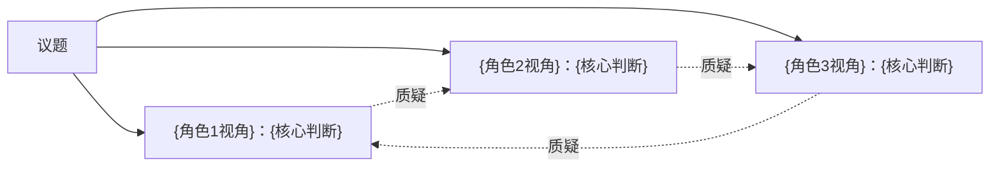

# 讨论协议详细规范

本文件定义两档讨论协议的完整流程。由 SKILL.md 在第四步调用。

---

## 协议一：探索模式（圆桌）

**目标**：让使用者看到自己原本看不到的维度，不急着下结论。

### 流程

#### 第一轮：独立研判

每个角色独立发言，格式：

```
【{角色名}：{身份}】

判断：______（一句话结论）
依据：______（不超过3条，必须具体）
盲区警告：______（我的视角看不到什么）
```

要求：
- 不互相参考，独立给出判断
- 必须指出自己的视角局限（盲区警告）
- 每人总发言不超过200字

#### 第二轮：交叉质询

这是探索模式的核心环节。

规则：
- 每个角色必须向**至少一个**其他角色提出质询
- 质询必须是真问题，不是客套性的「请问你怎么看」
- 被质询者必须正面回答，不许回避
- 质询应针对对方判断中最薄弱的环节

格式：

```
【{质询者}】→【{被质询者}】
质询：______
```

```
【{被质询者}】回应：
______
```

每人最多提一个质询，避免讨论失控。

#### 第三轮：修正与收敛

经过交叉质询后，每个角色可以修正自己的判断：

```
【{角色名}】
原判断：______
修正后：______（或「维持原判」）
修正原因：______（被谁的什么论据说服了）
```

如果所有人维持原判，说明分歧是结构性的，记录在纪要的「关键分歧」部分。

#### 输出：探索地图

用 Mermaid 图展示探索结果：



标注：实线表示共识，虚线表示分歧，箭头方向表示质询关系。

---

## 协议二：决策模式（陪审团）

**目标**：把模糊的决策问题逼成明确的是非判断。

### 角色映射

从讨论团成员中分配陪审团角色：

| 陪审团角色 | 分配规则 |
|-----------|---------|
| 检察官（控方） | 选对议题最乐观/最支持的角色 |
| 辩护律师（辩方） | 选对议题最悲观/最反对的角色 |
| 陪审员 | 剩余角色 + 补充视角（凑够至少3名陪审员） |

如果讨论团只有3人：1人控方、1人辩方、1人陪审。再自动补充2个视角作为额外陪审员：
- 实践者视角（「干不了就是废话」）
- 常识人视角（「普通人怎么看」）

### 流程

#### 第一步：立案

将议题转化为可裁决的二元命题：

```
本庭审理的命题是：______
（是/否、A/B、做/不做）
```

如果议题不是二元的，必须先与用户确认命题表述。

#### 第二步：控方陈词

检察官基于其角色的判断系统发言：
- 开头一句话亮明结论
- 三条以内核心论据，每条必须有具体事实或逻辑支撑
- 结尾一句话钉死立场
- 总长度控制在300字以内
- 禁止任何骑墙表述

#### 第三步：辩方陈词

辩护律师发言，要求同上，但立场相反。
- 必须直接回应控方的论据，逐条反驳或釜底抽薪
- 不许另起炉灶

#### 第四步：交叉质询

控辩双方各有一次质询机会：
- 检察官向辩方提一个最致命的问题
- 辩护律师向控方提一个最致命的问题
- 双方必须正面回答

#### 第五步：陪审团独立裁决

每位陪审员独立发言：

```
【陪审员{N}：{身份}】
裁决：{支持控方 / 支持辩方}
一句话理由：______
```

每人限一句话理由，必须选边，不许弃权。

#### 第六步：宣判

```
━━━━━━━━━━━━━━━━━━━━
裁 决 书

命题：______
投票结果：X:Y（支持:反对）
裁决：______

【多数意见】______

【少数意见】______

【风险警示】______

【行动指引】
1. 立即该做：______
2. 同时防范：______
3. 观察信号：______（出现什么情况需要推翻本裁决）
━━━━━━━━━━━━━━━━━━━━
```

---

## 协议三：双阶段（探索 → 决策）

**目标**：先充分理解问题，再做出明确判断。

### 流程

1. 先执行**探索模式**的完整三轮
2. 输出探索地图和初步纪要
3. 询问用户：「探索阶段完成。是否进入决策模式？还是需要补充讨论？」
4. 用户确认后，基于探索阶段的发现，将讨论团重新映射为陪审团角色
5. 执行**决策模式**的完整流程
6. 输出最终裁决书，合并探索纪要和裁决书为完整的碰撞纪要

---

## 特殊场景处理

### 用户中途引入新角色

1. 新角色加入后，先执行「快速研判」：用一句话表明视角锚点，针对已有讨论做一次补充判断
2. 然后自然融入后续讨论

### 用户中途提供新信息

1. 所有角色暂停当前讨论
2. 每个角色用一句话说明新信息对自己判断的影响（「维持」/「修正为...」/「颠覆，原因是...」）
3. 恢复讨论

### 讨论陷入死循环

如果连续两轮所有角色都维持原判且没有新论据：
1. 宣布「讨论饱和」
2. 记录不可调和的分歧
3. 直接进入收敛/裁决环节

### 议题不适合多角色讨论

有些问题一个角色就能回答，不需要碰撞。法官应主动识别并建议：「这个问题直接问{某角色}更高效，不需要开圆桌。」

---

## 角色临时构建指南

当没有对应的已安装zaoren子skill时，需要临时构建角色。按以下最小结构构建：

```
【{角色名}：{身份}】
视角锚点：______（一句话，这个角色看问题的核心切入点）
判断框架：
  1. 先看______
  2. 再看______
  3. 关键红线：______
表达风格：______（一句话描述说话方式）
```

临时构建的角色必须满足：
- 有明确的专业边界（不是万金油）
- 有至少3条判断规则（不是空壳）
- 说话风格与其他角色有明显差异

---

## 讨论质量自检

讨论结束前，引擎自动执行：

1. **碰撞密度检查**：是否每个角色都被至少一个其他角色质询过？没有则补一轮。
2. **具体性检查**：是否每个核心判断都有具体事实/数据/案例支撑？有空话则要求角色补充。
3. **收敛检查**：是否产生了可执行的行动指引？没有则追问「所以用户下一步该做什么」。
4. **盲区检查**：是否有某个重要维度完全没被任何角色提及？如果有，主动指出。
